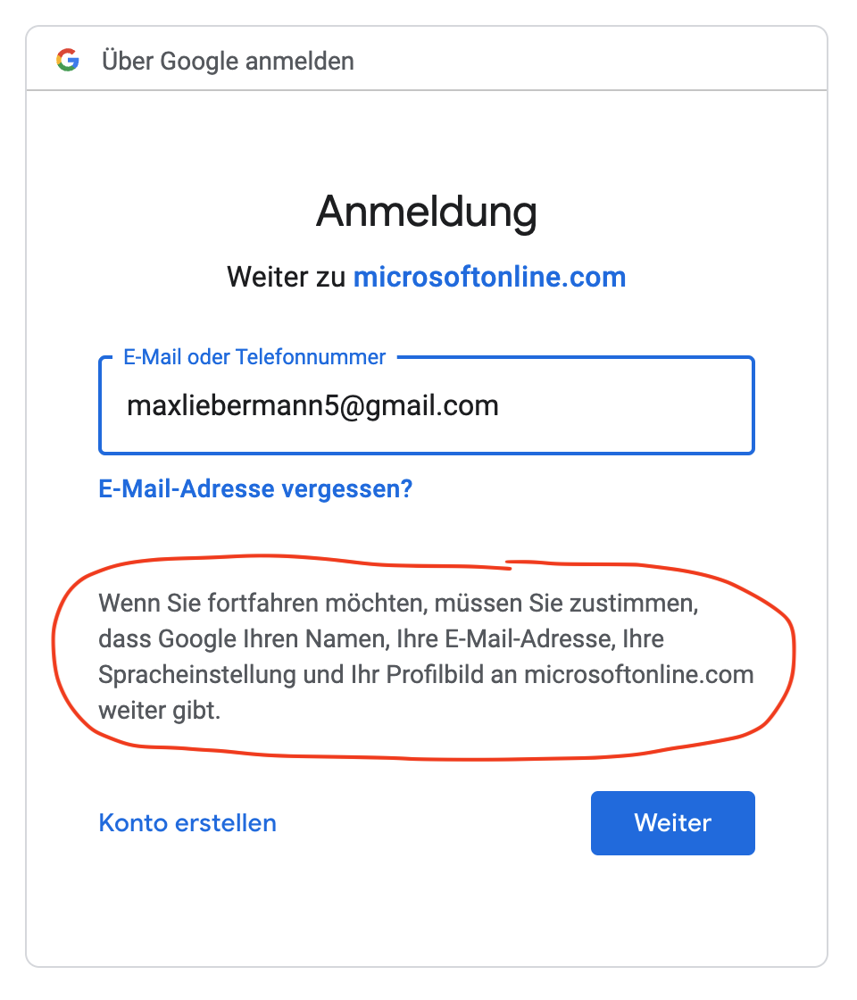
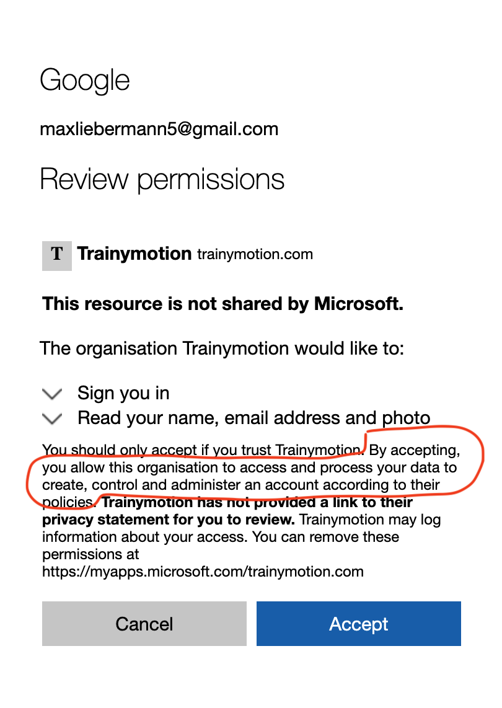

## Add Google as an identity provider for B2B

[Microsoft Docs](https://docs.microsoft.com/en-us/azure/active-directory/external-identities/google-federation)

To enable Google B2B as an identity provider for an Azure AD tenant 

* Go to the Google app [Azure AD B2B](https://console.cloud.google.com/welcome?project=azure-ad-b2b-292013):

* Ajust redirect URL:

## Test

Login to https://myapps.microsoft.com/trainymotion.com for the first time:

